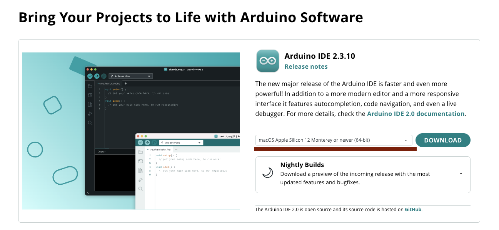
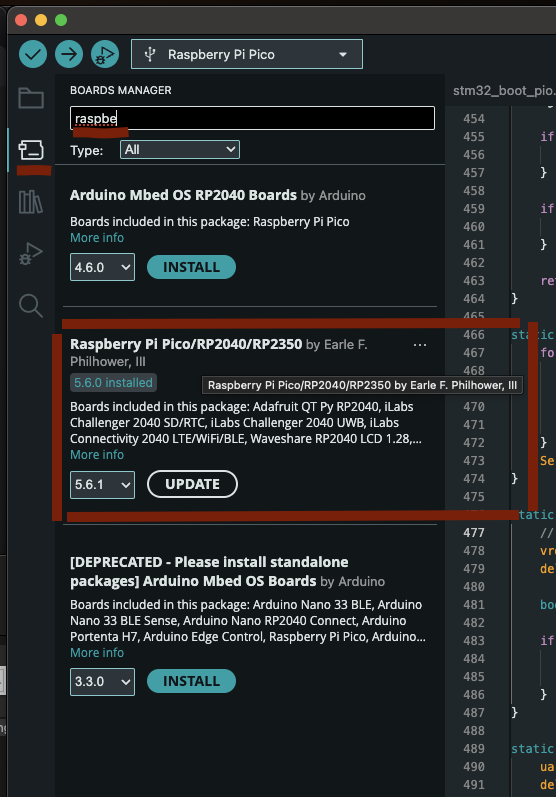

---
Что установить для всех:

### Arduino
[Arduino IDE](https://www.arduino.cc/en/software/)
Выбирайте свою платформу и устанавливайте:


### Board support для Arduino
Слева на панели находим кнопку как на картинке (Boards, Менеджер Плат)

Нажимаем "УСТАНОВКА"

### Остальные утилитки
для MacOS
```
brew update
brew install make hexyl stlink open-ocd
brew install --cask gcc-arm-embedded
```
или для Ubuntu/Debian
```
sudo apt update
sudo apt install  make hexyl gcc-arm-none-eabi libnewlib-arm-none-eabi stlink-tools openocd
```
или для Rocky / Alma / RHEL
```
sudo dnf install epel-release

sudo dnf install make hexyl arm-none-eabi-gcc-cs arm-none-eabi-newlib stlink openocd
```
или для openSUSE
```
sudo zypper install make hexyl cross-arm-none-eabi-gcc cross-arm-none-eabi-newlib stlink openocd
```

